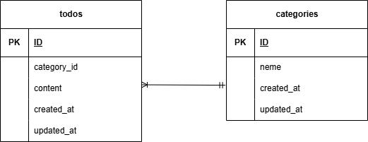

# Todoアプリ

このリポジトリは、Laravelを使用したTodoアプリです。

## 環境構築

#### リポジトリをクローン

```
git clone git@github.com:koko-chii/todo3.git
```
#### ディレクトリ移動

```
cd todo3
```
#### Laravelのビルド

```
docker-compose up -d --build

```
#### ディレクトリ移動

```
cd src
```
#### .env ファイルの作成

```
cp .env.example .env
```

#### .env ファイルの修正

```
DB_CONNECTION=mysql
DB_HOST=mysql
DB_DATABASE=laravel_db
DB_USERNAME=laravel_user
DB_PASSWORD=laravel_pass
```
#### Laravel パッケージのダウンロード

```
docker-compose exec php composer install
```
#### キー生成

```
docker-compose exec php php artisan key:generate
```
#### 権限の付与

```
cd ..
```

```
docker-compose exec php chmod -R 777 storage bootstrap/cache
```
#### マイグレーション・シーディングを実行

```
docker-compose exec php php artisan migrate --seed
```

## 使用技術（実行環境）

フレームワーク：Laravel 8.x (v8.75)

言語：PHP 7.3 / 8.0 以上

Webサーバー：nginx:1.21.1

データベース：mysql:8.0.26

## ER図



## URL

アプリケーション：http://localhost


phpMyAdmin：http://localhost:8080

